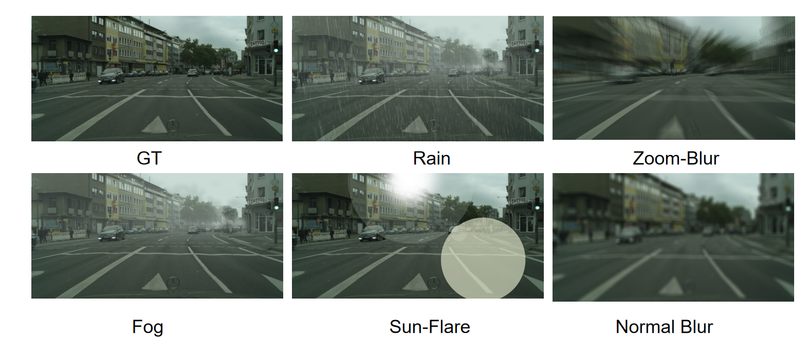

# Image Quality 

## Introduction
In this repository, we propose a deep learning based
image quality estimator. The image under bad weather conditions(rain,
fog) and blur/exposure will be considered as low quality.

## Data Acquisition
The training images are from [Cityscape](https://www.cityscapes-dataset.com/downloads/)
which includes cityscape_rain and cityscape_foggy. As for other scenarios,
we use Albumentation to simulate. Below is samples of our training images.

